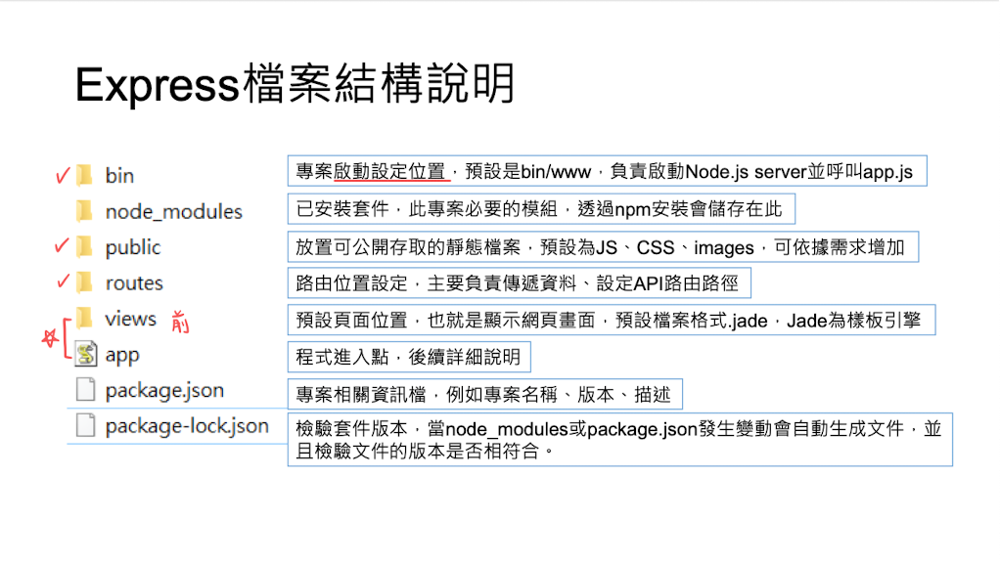
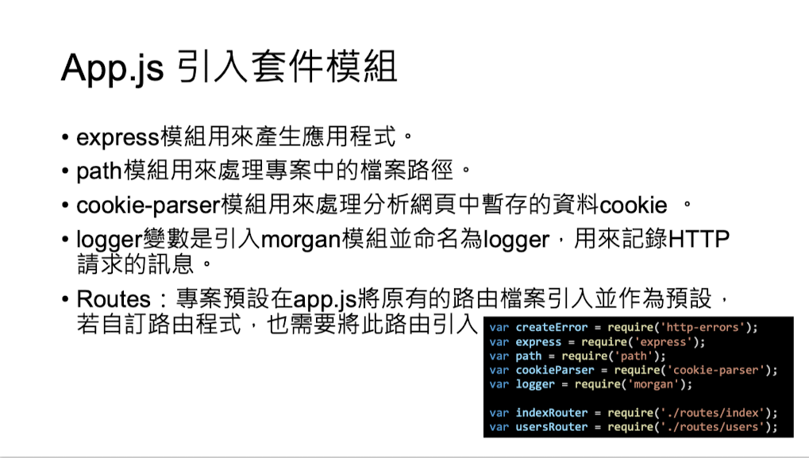

# Note.js with express generator

## Why express generator?

1. 透過 generator，快速產生 express 專案，**不在需要手動新增基本的檔案**

## How to start?

1. 下載 express-generator：`sudo npm i express-generator -g`
    - `sudo`：使用管理員權限執行
    - `-g`：全專案環境皆可使用

2. 開新專案：`express --view=pug "APP-NAME"`

3. 進入專案資料夾路徑：`cd "APP-NAME"`

4. 下載相關套件：`npm install`

5. 將 package.json 中的指令改成 `nodemon`

6. 運行專案：`npm start`

7. 建立 modules 資料夾

## Project Files

## Package.json

## Dependencies

1. 解除安裝：`npm uninstall express PACKAGE_NAME`

2. 自動紀錄新增安裝套件名稱：安裝過程中加 `--save` 會自動加入 dependency 中

## App.js

## Modules

1. 避免混淆我們可以另建一資料夾放自訂模組

2. 不管是路由或 app.js，最後一行都是用模組方式輸出，讓其他程式可以使用

## Request method

||GET|POST|
|:-:|:-:|:-:|
|Header|V|V|
|Body|X|V|
|Note||機密資訊會放 body|
